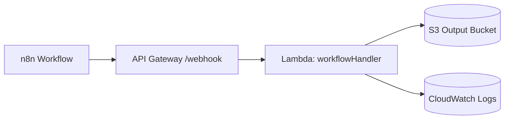

## Workflow Automation Platform Architecture

This project demonstrates an event-driven automation platform that connects n8n, AWS API Gateway, AWS Lambda, and Amazon S3, with CloudWatch providing centralized logging and observability.

### High-level flow

- n8n receives inbound HTTP requests and forwards validated payloads to a dedicated API Gateway endpoint.
- API Gateway exposes a `POST /webhook` route that triggers the `workflowHandler` Lambda function.
- The Lambda function validates the payload, enriches it with processing metadata, persists results to S3 (when configured), and emits structured logs.
- CloudWatch collects logs and metrics for monitoring, alerting, and incident response.

### Mermaid architecture diagram

